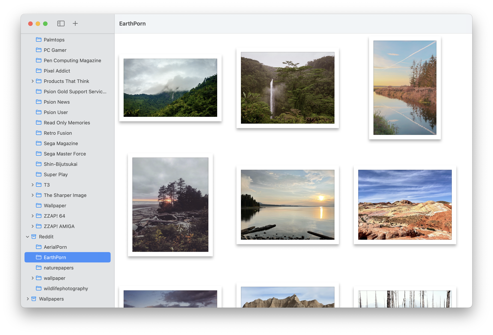

# Folders

[](https://github.com/inseven/folders/actions/workflows/build.yaml)

Local-first library management for your files



## Platforms

### macOS


### Linux

Right now, this is simply a proof-of-concept reimplementation using Rust and GTK.

>  Since spending more time using Fedora and GNOME, I've found myself missing [Fileaway](https://github.com/inseven/fileaway) and [Folders](https://github.com/inseven/folders), my file management apps for macOS and iOS. This repository is therefore an experiment to see how hard it would be to reimplement the file observing core of those apps in Rust to be shared across both Apple-native and Linux-native UI toolkits. It's very much a learning exercise and you probably don't want to use this code for... anything in its current form. Not least because it's the first time I'm writing Rust and GTK. If it evolves into something more functional, I'll likely turn it into a dedicated library, or fold it into Fileaway or Rust.

## Development

### Dependencies

Folders uses [mise-en-place](https://mise.jdx.dev) and the `.tool-versions` file to manage development tools dependencies. After [installing mise](https://mise.jdx.dev/installing-mise.html), you can install the necessary tooling as follows:

```shell
mise install
```

Some of the build script configure a local directory of dependencies in `.local`. You can install these in preparation for running full builds as follows:

```shell
scripts/install-dependencies.sh
```

### Documentation

The [project website](https://folders.jbmorley.co.uk) is built using a combination of Jekyll and a couple of custom bash scripts to build-out the release pages.

You can run a local Jekyll server for development as follows (see [Dependencies](#dependencies) for details on how to install the necessary tools dependencies):

```shell
cd docs
bundle exec jekyll serve --watch
```


